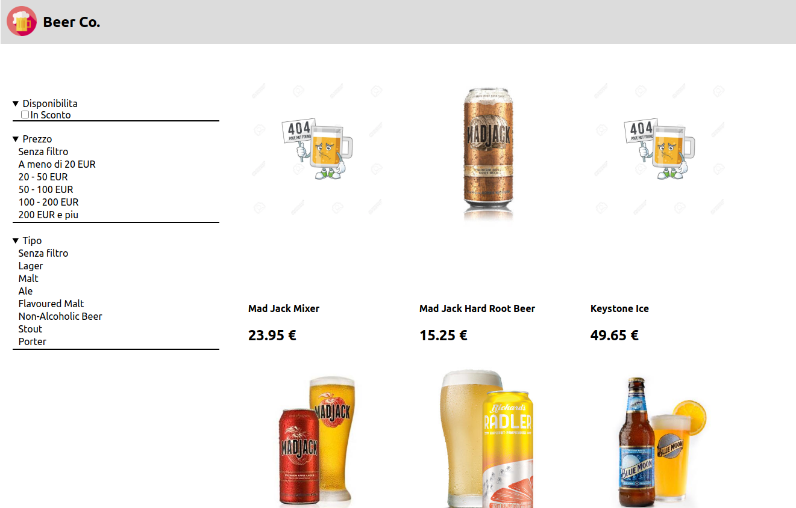

# Project Name

> This is a simple web application that give the user the possibility to explore a list of beers, the user can use a couple of filters to change the list of beers that is displayed on the screen.

## Built With

- Javascript
- React
- Redux
- Redux Toolkit
- CSS
- HTML

## Live Demo

[Live Demo Link](https://livedemo.com)

## Getting Started

To get a local copy up and running follow these simple example steps.

### Prerequisites

- Npm
- A code editor
- Command line knowledge

### Setup

- Download the repository or copy this in your terminal `git@github.com:helman101/Beer-Co..git`
- Go to the project folder with `cd Beer-Co`

### Install

- Use `npm i` or `npm install` to install all the necessary dependencies

### Usage

- Run the project locally with `npm run start`

## Authors

👤 **Andres Ortegon**

- GitHub: [@githubhandle](https://github.com/helman101)
- LinkedIn: [LinkedIn](https://www.linkedin.com/in/helman101/)

## 🤝 Contributing

Contributions, issues, and feature requests are welcome!

Feel free to check the [issues page](../../issues/).

## Show your support

Give a ⭐️ if you like this project!

## Acknowledgments

- Thank for the icons [Freepik](https://www.freepik.com) from [www.flaticon.com](https://www.flaticon.com/)